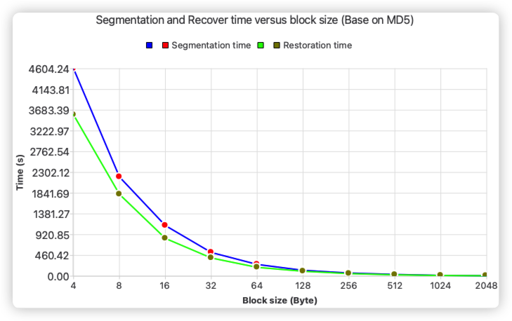
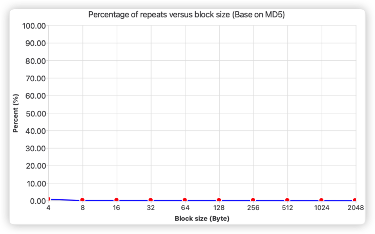

 
 
<b>Block Storage Tester</b>

 
<b>哈希分块存储测试器</b>

<!-- 顶部至此截止 -->

[toc]

>**引言：**
>
>当代数据存储的趋势是创建分布式存储系统，这些系统具有良好的可扩展性、高可靠性、安全性、性能，并能处理巨大量的输入数据。这些分布式存储系统部署在云基础设施中，后者本身具有为各种数据服务创造和使用的巨大潜力。
>
>数据存储的一个重要方面是降低数据存储成本。对于非结构化数据或以字节序列形式存在于磁盘上的数据，可以使用数据去重方法来优化存储。本文提出了在本地存储上实现数据去重解决方案的原型。数据去重指的是在信息存储介质（硬盘）上仅存储唯一数据块的物理存储。
>
>**任何去重算法都基于计算输入数据流块的哈希函数。基于这个哈希函数，系统决定是否已经存在相同的数据块。如果数据块不存在，则将其写入存储；如果存在，则用指向存储中已存在数据的引用来替换它。**
>
>为了判断系统中是否存在具有特定哈希值的数据块，需要保留一个包含哈希值和对应数据块的存储引用的表。 哈希表通常可能包含两列：“哈希值”和“数据块引用”。但需要注意的是，为了去重和垃圾回收，经常需要存储额外信息，比如：数据块的引用计数。

# 目标与任务

本研究的目标是通过使用数据去重方法实现数据的最优存储，并进行性能测试以评估创建的原型的性能。为达到目标，需要解决以下任务：

- 研究在传统数据库中优化数据存储的方法；
- 选择创建去重系统原型所需的技术栈；
- 开发磁盘上的数据最优存储系统；
- **进行负载测试，并确定数据在本地存储中的读写速度与数据块大小的关系；**
- 确定数据块的最优大小，以实现：
    - **最大的写入速度**
    - **最大的读取速度**
    - 将输入数据流分割成指定大小的块；
    - **依赖于使用的哈希算法的数据恢复错误率。**

**系统工作算法** 处理非结构化数据去重的算法可以按以下步骤进行：

- 将输入数据流划分为指定大小的数据块（段）
- 计算每个块的哈希值；
- 与存储介质上已存在数据的哈希表进行比对；
- 如果数据的哈希值已存在，则只需为输入数据流保存一个引用到已存在的数据；
- 如果数据不存在，则在磁盘上保存新的数据块，并在表中记录这个块的哈希值和相应的位置。

# 需求

## 系统需求

为了有效解决所定义的任务，本工作将实现一个带有图形用户界面的跨平台测试工具。此工具旨在提供用户友好的交互和性能评测功能，支持哈希计算、块大小调整等操作。以下是系统需求和技术需求的详细说明：

- 数据库自动创建和连接功能，以及其他数据表自动管理功能
- 允许用户指定分块大小，块大小为 $2^n, (1 \leq n \leq 11)$
- 允许用户指定源文件、存储块哈希值的文件和恢复文件
- 允许用户指定分块所需的哈希算法
- 程序根据用户输入的源文件、块大小和哈希算法，自动执行文件分块测试：测试流程包括对每个块进行哈希计算、与数据库中的哈希值进行对比、并根据去重策略进行存储数据块的哈希值或数据库引用计数更新
- 支持数据恢复测试：通过读取存储块哈希值文件，将数据重组为原始文件，以验证数据恢复的准确率
- 允许测试结果以表格和动态图表的形式呈现，并可以自动记录为 CSV 格式
- 允许用户执行基于某种哈希算法和块大小的单步测试
- 允许用户执行基于指定哈希算法的基准测试

## 技术需求

为了确保系统的稳定性、性能和可扩展性，本项目采用现代软件设计原则和开发技术。以下是系统的技术需求：

- 确保跨平台性和可扩展性
- 程序支持状态保存和恢复
- 采用“高内聚、低耦合”的设计原则，系统划分为表示层（UI）、业务逻辑层（BLL）和数据访问层（DAL），实现功能模块的独立开发和维护
- 支持多线程处理，将计算密集型任务与 UI 显示分离，提升响应速度
- 通过事务机制确保多线程操作下的数据一致性和完整性

# 实施阶段

## 处理流程

对于本项工作，主要需要解决两项**计算任务**，即为

1. **源文件分块任务**：将源文件按指定大小进行分块，计算每个块的哈希值，并将块的哈希值及相关信息存储到数据库中或更新数据库中的计数器。同时，将源文件的所有块的哈希值保存为块哈希文件（.bkh）
2. **文件恢复任务**：根据块哈希文件（.bkh）中的哈希值，通过查询数据库中的记录，将对应的数据块重新组合，恢复出原始文件

以下是两项任务的流程图。

### 源文件分块

对源文件分块的流程图如下：

### 恢复源文件

恢复源文件的流程图如下：

## 数据存储结构

对于本项工作，主要需要解决两项**存储任务**，即为文件块信息在数据库中的记录和分块哈希值记录的存储。具体设计如下：

### 块信息的数据库存储

为保证不同块大小和对应哈希算法的分离，每种块大小及其哈希算法将对应一个独立的数据表。数据库表的设计包含 5 个字段，涵盖了恢复源文件所需的所有关键信息：

- **哈希值**：当前块的唯一标识
- **源文件路径**：块所属的源文件路径
- **块起始位置**：当前块在源文件中的起始位置
- **块大小**：当前块的大小
- **重复次数**：该块被引用的次数

基于这些信息，可以借助C/C++的指针操作定位并读取指定的数据块。由于哈希值具有唯一性，因此将其设置为唯一键（UNIQUE），以提升数据存储和检索的效率。

### 块哈希文件存储

为了记录源文件每个数据块的哈希值，我们采用独立文件进行存储，称之为“块哈希文件”，文件格式为 `.bkh`（Block Hash）。由于不同哈希算法生成的哈希值长度是固定的，因此采用连续存储的方式，将每个块的哈希值顺序写入文件。在文件恢复过程中，通过指针移动固定的间隔即可读取对应的哈希记录，并通过数据库中记录的信息重建源文件。

## 技术栈

为实现本项目的目标，我们选择了以下技术栈：

我们选择用 C++作为编程语言，利用其高效的内存管理和出色的性能表现，尤其适合实现需要低延迟、高性能的数据处理系统。C++ 在本项目中的一个关键优势是对指针的灵活操作，特别是在数据块存储与恢复时，指针可以高效地定位文件块的起始位置，从而实现快速读取和写入操作。这种内存操作的精细控制，使得 C++ 非常适合处理文件分块和哈希计算等高性能任务。

我们使用 Qt 作为跨平台应用开发框架，Qt 所提供的库中除了为项目提供简便的数据结构、线程管理和 I/O 操作外，还为我们提供了强大的用户界面设计工具。通过 Qt，我们能够构建直观的图形用户界面（GUI），用于展示系统状态和性能测试结果。并且借助其信号与槽机制（Singal and Solt），我们能够在系统中实现高效的异步通信与线程管理。**信号与槽机制**是Qt框架中的核心设计之一，它基于**观察者模式**实现了模块间的异步事件传递，这在多线程环境下尤为重要。如下图所示，通过信号与槽机制，不同模块可以在不直接耦合的前提下实现高效的消息传递，保证了系统的模块化设计和可维护性。

在数据库层面，使用PostgreSQL作为关系型数据库管理系统。PostgreSQL的高可扩展性和复杂查询支持，使其非常适合处理大规模结构化与非结构化数据。在数据去重过程中，PostgreSQL用作存储哈希值和数据块引用的数据库，确保哈希表的快速检索和更新。此外，PostgreSQL的ACID事务支持确保了在并发写操作时的数据一致性，避免了哈希值冲突和写操作冲突的问题，从而提升了系统的稳定性和可靠性。

以下是本项目中所使用的主要框架和工具的具体版本：

- C++ 17
- Qt 6.7.2
- PostgreSQL 16
- Qt Creator 14.0.1

## GUI 设计

我们借助 Qt Design Studio 对程序的界面进行设计，最终的程序 GUI 设计如下图所示：

GUI 设计主要划分为两个核心区域：**信息输入区域** 和 **结果展示区域**，具体功能设计如下：

- 通过 ⓵ DataBase ，用户可以通过输入相关信息配置所需连接的数据库。配置完成后，用户可通过点击按钮进行数据库连接，界面将实时反馈连接状态。
- 通过 ⓶ Input Segmentation and Recover infomation 用户可以在此选择源文件、哈希块文件和恢复文件的路径，并指定分块大小和哈希算法。完成设置后，用户通过点击按钮执行单步测试，系统将根据设定自动进行分割和恢复测试任务。
- 当前正在执行分块任务的结果将实时显示在 ⓷ Segmentation ouput infomation 区域
- 当前正在执行恢复任务的结果将实时显示在 ⓸ Recover ouput infomation 区域
- 在右侧的**基准测试与绘图区域**，用户可以根据所选的哈希算法执行基准测试，测试结果会以动态图表形式实时展示在右侧绘图区，便于观察不同块大小下的性能表现
- 所有测试结果和日志信息将以表格形式显示在界面左下方，便于用户查阅历史记录及详细信息

## 架构

本工作的架构设计如下图所示

架构包含 5 个主要模块，分别负责不同的核心功能。具体说明如下：

- **GUI 模块（主线程）**：负责处理用户输入，通过信号机制将输入的数据传递给异步计算模块。该模块通过槽函数接收异步计算结果，实时更新界面，动态展示分块或恢复任务的执行进度和结果。
- **异步计算模块**：此模块负责执行数据的分块和恢复任务，是核心的计算执行部分。异步计算模块能够并行处理任务，提升系统的响应性和性能。它与数据库模块交互，执行数据库的读写操作，同时调用哈希模块进行哈希计算。最终的计算结果通过信号传递给 GUI 模块进行展示。
- **哈希模块**：封装了各类哈希算法，负责为每个数据块计算哈希值。该模块支持多种哈希算法，并提供关于每种算法的相关信息，如哈希长度
- **数据库模块**：该模块包含数据库驱动，并且对本任务中所需要的数据库操作进行了封装，包括：自动连接/创建/删除数据库、数据表的增删改查等
- **文件模块**：该模块封装了本工作所需要的文件操作。如获取文件信息、文件写入读取等

# 结果

本次工作在以下开发和测试环境中进行：
- 操作系统：MacOS Sonoma 14.6.1
- CPU：Apple M1 Pro
- RAM：16 GB

测试过程中使用了不同的块大小和哈希算法，以评估系统在不同配置下的性能表现：

- **可选块大小**：4KB、8KB、16KB、32KB、64KB、128KB、256KB、512KB、1024KB、2048KB
- **支持的哈希算法**：MD5、SHA1、SHA256、SHA512

为了评估性能，选择了两种类型的文件进行测试：

- **文本文档**：莎士比亚英文全集（文件大小：10.02 MB）
- **图像文件**：JPEG格式图像（文件大小：15.3 MB）

## 性能瓶颈

在软件开发过程中，我们使用“莎士比亚英文全集”作为测试数据，块大小为 4KB，哈希算法为 MD5，进行了性能测试。结果表明，计算所有数据块的哈希值并写入文件仅需 **4.79 秒**，这意味着数据库的读取和存储操作占用了 **99.99%** 的时间，成为系统的主要性能瓶颈。为了应对这一问题，我们对数据库设计进行了优化，具体是为哈希记录字段添加了唯一键（UNIQUE）约束，以加速数据的检索和插入操作。

为评估这一优化的效果，我们使用相同的测试数据和参数进行对比测试。未设置 UNIQUE 约束时，分块操作耗时 **14023.51 秒**（约 **3.89 小时**），恢复操作耗时 **8907.26 秒**（约 **2.47 小时**）。当哈希记录字段增加了 UNIQUE 约束后，分块和恢复操作的时间大幅减少，分别降至 **3062 秒**（约 **0.85 小时**）和 **1057.95 秒**（约 **0.29 小时**）。通过计算可得，系统的分块操作效率提升了 **358%**，恢复操作的效率则提升了 **841%**。

## 存储格式

下图中展示了数据库中块信息的记录和块哈希文件的内容。可以看到长度为 16 字节的哈希值既写入到了数据库中，又连续写入到了文件当中。

## 文本文档

使用 MD5 哈希算法对不同块大小的文本文件进行分割和恢复测试，结果如下：

| 块大小 | 块数量  | 数据库哈希记录 | 重复块的数量 | 重复率     | 分割用时 | 成功恢复块的数量 | 恢复率 | 恢复用时 |
| ------ | ------- | -------------- | ------------ | ---------- | -------- | ---------------- | ------ | -------- |
| 4      | 2543944 | 58427          | 2485517      | 97.7033    | 3062.74  | 2543944          | 100    | 1057.95  |
| 8      | 1271972 | 559060         | 712912       | 56.0478    | 983.414  | 1271972          | 100    | 508.324  |
| 16     | 635986  | 573830         | 62156        | 9.77317    | 434.088  | 635986           | 100    | 226.418  |
| 32     | 317993  | 310003         | 7990         | 2.51263    | 206.961  | 317993           | 100    | 129.01   |
| 64     | 158997  | 158240         | 757          | 0.47611    | 123.199  | 158997           | 100    | 67.682   |
| 128    | 79499   | 79494          | 5            | 0.00628939 | 62.878   | 79499            | 100    | 34.086   |
| 256    | 39750   | 39749          | 1            | 0.00251572 | 31.84    | 39750            | 100    | 16.545   |
| 512    | 19875   | 19875          | 0            | 0          | 15.937   | 19875            | 100    | 5.195    |
| 1024   | 9938    | 9938           | 0            | 0          | 8.424    | 9938             | 100    | 1.281    |
| 2024   | 5028    | 5028           | 0            | 0          | 4.401    | 5028             | 100    | 2.15     |

将其用图像的形式表示：

首先，我们可以看到，在块大小较小时，重复率显著提高。例如，当块大小为 4KB 时，重复率达到了 **97.7%**，而 8KB 时重复率也达到了 **56.0%**。这说明较小的块可以更容易地识别文件中相同的部分，尤其是在文本文件中，许多段落和单词重复出现的情况较为常见。这种高重复率有助于大幅减少存储空间需求，但代价是较多的计算和数据库操作。

随着块大小的增大，重复率逐渐下降。当块大小达到 32KB 时，重复率已降至 **2.5%**，而当块大小增大到 128KB 及以上时，重复率几乎为零。这是因为块越大，包含的数据越多，每个块的独特性增加，文件中的重复块也相对减少，导致哈希值更为独特，从而减少了去重的效果。

从分块时间来看，随着块大小的增大，分割用时呈指数级减少。例如，4KB 块的分块时间为 **3062.74 秒**，而 2048KB 块只需要 **4.4 秒**。这反映出小块虽然能有效地识别重复数据，但由于需要进行更多的哈希计算和数据库操作，每个块的处理时间也相对增加。相比之下，较大的块减少了块的数量，从而降低了系统的负载，提高了分块速度。

文件的恢复时间也表现出类似的趋势。当使用 4KB 块时，恢复时间为 **1057.95 秒**，而 2048KB 块的恢复时间仅为 **2.15 秒**。恢复操作的用时同样受块数量影响，较小的块需要进行更多的 I/O 操作和哈希匹配，因此恢复时间较长。而大块减少了操作次数，使得恢复过程更加高效。

## 图像

使用 MD5 哈希算法对不同块大小的JPEG 图像文件进行分割和恢复测试，结果如下：

| 块大小 | 块数量  | 数据库哈希记录 | 重复块的数量 | 重复率    | 分割用时 | 成功恢复块的数量 | 恢复率 | 恢复用时 |
| ------ | ------- | -------------- | ------------ | --------- | -------- | ---------------- | ------ | -------- |
| 4      | 3830514 | 3801114        | 29400        | 0.767521  | 4604.24  | 3830514          | 100    | 3579.54  |
| 8      | 1915257 | 1911806        | 3451         | 0.180185  | 2201.32  | 1915257          | 100    | 1816.2   |
| 16     | 957629  | 956071         | 1558         | 0.162693  | 1122.65  | 957629           | 100    | 837.522  |
| 32     | 478815  | 478105         | 710          | 0.148283  | 525.38   | 478815           | 100    | 403.251  |
| 64     | 239408  | 239087         | 321          | 0.134081  | 259.902  | 239408           | 100    | 195.03   |
| 128    | 119704  | 119567         | 137          | 0.114449  | 128.8    | 119704           | 100    | 108.162  |
| 256    | 59852   | 59793          | 59           | 0.0985765 | 69.046   | 59852            | 100    | 56.366   |
| 512    | 29926   | 29905          | 21           | 0.0701731 | 37.477   | 29926            | 100    | 29.86    |
| 1024   | 14963   | 14958          | 5            | 0.0334158 | 16.08    | 14963            | 100    | 14.457   |
| 2024   | 7571    | 7571           | 0            | 0         | 8.403    | 7571             | 100    | 8.419    |

从图像文件的测试结果中，我们可以看到与文本文件测试类似的趋势，但由于图像文件的特性，结果有一些明显的不同之处。

首先，**重复率（Repeat Rate）** 在图像文件的测试中相对较低，尤其是在小块大小（4KB）的情况下，重复率仅为 **0.7675%**，而在 2048KB 的块大小时重复率为 **0%**。这与图像文件的非结构化特性有关，图像中的数据通常更加连续且复杂，不同于文本文件中重复词句较多的情况。因此，即使块的大小较小，数据的重复性也相对较低。

**分块时间（Segmentation Time）和恢复时间（Recovered Time）** 方面，我们同样看到随着块大小的增大，时间呈指数级减少。例如，4KB 块的分块时间为 **4604.24 秒**，恢复时间为 **3579.54 秒**；而 2048KB 块的分块和恢复时间为 **8.4 秒**。这与文本文件的情况类似，小块需要更多的哈希计算、数据库操作和 I/O 操作，导致用时明显增长。而随着块的增大，块数减少，用时相应缩短。

# 总结

在本工作中，我们设计并开发了一个具有 GUI 的跨平台高性能、可扩展的重复数据删除存储系统。通过对文本文件和图像文件的测试结果分析，表明块大小的选择需在去重效果与处理性能之间找到最佳平衡。

对于文本文件，由于其词句具有高度重复的特性，较小的块可以带来显著的去重效果。具体来说，**16KB 至 64KB** 之间的块大小是较为理想的选择。使用 **16KB** 块，去重率接近 **10%**，能够在存储效率上表现良好，同时处理时间也处于可接受的范围。而 **32KB** 块进一步减少了系统的计算负担，仍能保持适度的去重效果（约 **2.5%**），同时大幅缩短了分块和恢复时间。对于性能要求较高的场景，**64KB** 块的处理速度明显加快，虽然去重率降低至不到 **0.5%**，但处理效率的提升使其适合快速存储和恢复的需求。

对于单张图像文件，不适合作为去重存储的主要对象，因为这种文件的内在结构缺乏足够的重复模式，因此去重策略难以显著减少存储空间。在实际应用中，针对图像文件的存储方案可以更多地依赖压缩技术，而不是去重。压缩算法能够有效地处理图像文件的连续数据结构，减少存储需求。

由于测试时间和成本的限制，本工作中的测试主要集中在相对较小的文件上。但在PB级大型存储系统中，由于数据规模大幅提升，块大小的选择可以更倾向于较大的块。在这种大规模存储环境下，根据概率论，重复数据块的出现几率会显著提高，即使使用较大的块，依然可以获得较高的去重率。因此，在大型存储系统中，使用较大的块（如 **512KB 至 1MB**）不仅可以识别出足够的重复数据，还能减少系统的处理负担。较大的块减少了系统对数据库的写入操作和哈希计算次数，从而显著提升分块和恢复的效率。

总之，对于文件块大小的选择，要通过文件类型和存储规模综合考虑。

