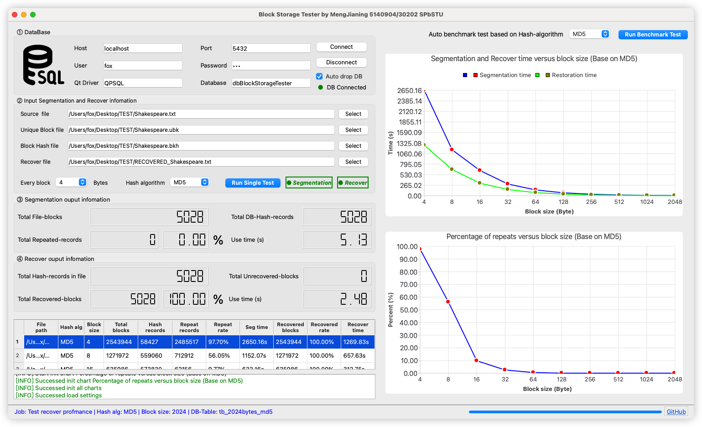

 
 
<b>Block Storage Tester</b>

 
<b>Исследование подходов к созданию высокопроизводительного, масштабируемого сервиса для дедупликации данных в хранилище</b>

    <a href="../README.md">简体中文</a>

<!-- 顶部至此截止 -->

[toc]

>**Введение**
>
>Современный тренд в области хранения данных направлен на создание распределенных хранилищ, которые могут быть хорошо масштабируемы, обладают высокой надежностью, безопасностью, производительностью и позволяют хранить и обрабатывать колоссальный объем входных данных. Такие распределенные хранилища размещают в облачной инфраструктуре, которая в свою очередь обладает огромным потенциалом для создания и использования различных сервисов обслуживания данных.
>
>Одним из важных аспектов хранения является минимизация стоимости хранения данных. Для неструктурированных данных или данных, которые представляются в виде последовательности байт на диске, для оптимального хранения можно использовать подходы дедупликации. В данной работе предлагается создать прототип решения по дедупликации данных на локальном хранилище. Под дедупликацией данных понимается физическое хранение на носителе информации (жестком диске) только уникальных блоков данных.
>
>Любой алгоритм дедупликации основан на вычислении hash-функции для блоков входного потока данных. На основе этой hash-функции делается решение, существует ли уже в системе входной блок данных или нет. Если блок не существует, то он записывается в хранилище, а если существует, то он заменяется ссылкой на уже существующий в хранилище.
>
>Для того, чтобы сделать вывод о том, существует ли в системе блок данных с заданным hash-значением, необходимо хранить таблицу hash- значений и ссылку в хранилище на соответствующий блок данных.
>
>Hash-таблица в общем случае может содержать две колонки: "Hash- значение", "Ссылка на блок данных". Но стоит иметь ввиду, что зачастую приходится хранить дополнительную информацию, необходимую для дедупликации и сборщика мусора, например: количество ссылок на блок данных.

# Цель и задачи

Цель работы состоит в реализации системы оптимального хранения данных за счет использования подхода дедупликации данных и проведении тестирования для измерения производительности созданного прототипа.

Задачи, которые требуется решить для достижения цели:

- изучить подходы к оптимизации хранения данных в традиционных базах данных;
- выбрать стек технологий, необходимый для создания прототипа системы дедупликации;
- разработать систему оптимального хранения данных на диске;
- провести нагрузочное тестирование и установить зависимость скорости чтения/записи данных в локальное хранилище в зависимости от размера сегмента;
- установить оптимальный размер сегмента блока данных, при котором наблюдается
    - максимальная скорость записи
    - максимальная скорость чтения
    - процент ошибки восстановления данных в зависимости от использованного алгоритма hash.

**Алгоритм работы системы：**

В работе можно следовать следующему алгоритму дедупликации неструктурированных данных:

- входной поток данных разделяется на блоки (сегменты) заданного объема;
- для каждого блока вычисляется hash;
- значение hash проверяется с таблицей уже существующих hash для данных, находящихся на носителе;
- если значение hash для данных уже есть, то для входного потока сохраняется лишь ссылка на уже существующие данные;
- если данных нет, то новый блок сохраняется на диске и hash этого блока записывается в таблицу с соответствующим расположением. [^1]

# Сценарий использования и системный анализ

Сценарий использования системы следующий: на локальном хранилище компьютера пользователя находится исходный файл. При передаче файла на сервер через интернет, файл сначала разделяется на блоки на стороне пользователя, и для каждого блока вычисляется его хеш-значение. Затем это хеш-значение сравнивается с записями хешей в базе данных сервера. Одновременно с этим на сервере создаётся файл хеш-значений блоков для соответствующего исходного файла, что позволяет в дальнейшем восстанавливать файл. Этот файл последовательно сохраняет хеш-значения каждого блока исходного файла.

Если хеш-значение блока файла успешно совпадает с записью в базе данных, это означает, что данный блок уже существует на сервере. В этом случае серверу достаточно добавить ссылку в файл хеш-значений блоков, и передача самого блока данных не требуется.

Напротив, если в базе данных не найдётся соответствующего хеша, блок необходимо передать на сервер, создать новую запись в базе данных и добавить ссылку в файл хеш-значений блоков.

Для каждого файла в конечном итоге на сервере будут существовать три типа записей:

- **Файл уникальных блоков **: Хранение фактических блоков данных из исходного файла. Для повторяющихся блоков на сервере сохраняется только **один** уникальный экземпляр. Все уникальные блоки файла сохраняются как отдельные или группы в файлов. В данной системе такие файлы называются `Unique Block Files (.ubk)`.
- **База данных**: содержит хеш-значения блоков файла, расположение исходных блоков и другую информацию для дальнейшего поиска и сопоставления.
- **Файл хеш-значений блоков**: этот файл включает хеш-значения всех блоков исходного файла и используется для восстановления исходного файла. В данной системе этот файл называется `Block Hash Files (.bkh)`.

Этот подход позволяет значительно снизить нагрузку на облачные сервисы по передаче и хранению данных.

# Требования

## Системные требования

Для эффективного решения поставленных задач в рамках данного проекта будет разработан кроссплатформенный инструмент с графическим интерфейсом пользователя (GUI). Этот инструмент предназначен для обеспечения удобного взаимодействия с пользователем и выполнения оценки производительности, включая поддержку операций хеширования, регулирования размера блоков и других функций. Ниже приведены подробные системные и технические требования:：

- Автоматическое создание и подключение базы данных, а также автоматическое управление другими таблицами базы данных
- Возможность указания пользователем размера блоков, где размер блока выражен как $2^n$, где $1 \leq n \leq 11$
- Возможность указания пользователем исходного файла, файла для хранения хеш-значений блоков и файла для восстановления
- Возможность выбора пользователем алгоритма хеширования для выполнения разделения данных на блоки
- Программа должна автоматически выполнять тестирование разделения входного потока данных на блоки в соответствии с исходным файлом, размером блока и выбранным алгоритмом хеширования. Тестирование включает вычисление хеша каждого блока, сравнение с хеш-значениями, уже хранящимися в базе данных, и обновление данных в зависимости от стратегии дедупликации (сохранение нового хеш-значения или обновление счетчика ссылок на уже существующий блок)
- Поддержка тестирования восстановления данных: чтение файла с хеш-значениями блоков и воссоздание исходного файла для проверки точности восстановления.
- Возможность представления результатов тестирования в виде динамических таблиц и графиков с возможностью автоматической записи в формате CSV
- Возможность выполнения пошагового тестирования на основе определенного алгоритма хеширования и размера блока
- Возможность выполнения тестов производительности на основе указанного алгоритма хеширования

## Технические требования

Для обеспечения стабильности, производительности и масштабируемости системы в проекте используются современные принципы разработки программного обеспечения. Ниже приведены технические требования системы:

- Обеспечение кроссплатформенности и масштабируемости
- Поддержка сохранения и восстановления состояния программы
- Применение принципов "высокой связности и низкой зависимости", что подразумевает разделение системы на слои представления (UI), бизнес-логики (BLL) и доступа к данным (DAL), для обеспечения независимой разработки и поддержки функциональных модулей
- Поддержка многопоточной обработки, разделение вычислительно сложных задач и отображения в интерфейсе для повышения скорости отклика системы
- Обеспечение согласованности и целостности данных при многопоточном выполнении с использованием транзакционных механизмов

# Реализация

## Процесс обработки

В данного проекта необходимо решить две основные **вычислительные задачи**:

1. **Задача разделения исходного файла**: Исходный файл разделяется на блоки заданного размера, для каждого блока вычисляется его хеш-значение. Затем хеш-значение и соответствующая информация сохраняются или обновляется счетчик в базу данных. Все хеш-значения блоков исходного файла сохраняются в отдельный файл хеш-значений блоков (формат .bkh).
2. **Задача восстановления файла**: На основе файла хеш-значений блоков (.bkh) с помощью запроса к базе данных, происходит поиск соответствующих блоков и их повторная сборка для восстановления исходного файла.

Ниже представлены блок-схемы, описывающие процесс выполнения этих двух задач.

### Разделение исходного файла на блоки

Ниже представлена блок-схема процесса разделения исходного файла на блоки:

### Восстановление исходного файла

Ниже представлена блок-схема процесса восстановления исходного файла:

## Структура хранения данных

Согласно разделу «Сценарий использования и системный анализ», в данном проекте необходимо решить три основные **задачи хранения**: запись информации о блоках файла в базе данных, хранение уникальных блоков и хранение файла хеш-значений блоков. Конкретная структура данных представлена ниже:

### Хранение информации блоков в базе данных

Для разделения по размеру блоков и используемым алгоритмам хеширования, каждому размеру блока и соответствующему алгоритму хеширования будет соответствовать отдельная таблица базы данных. Дизайн таблицы включает 5 полей, содержащих всю необходимую информацию для восстановления исходного файла:

- **Хеш-значение**: уникальный идентификатор текущего блока
- **Путь к файлу, в котором находится блок данных**: путь к уникальному файлу блока (.ubk), в котором находится блок данных
- **Начальная позиция блока**: смещение блока в исходном файле
- **Размер блока**: размер текущего блока
- **Количество повторений данного блока**: число ссылок на данный блок (счетчик)

На основе этой информации с помощью указателей на языке C/C++ можно точно определить и прочитать нужные блоки данных. Поскольку хеш-значения уникальны, они будут установлены как уникальные ключи (UNIQUE), что повысит эффективность хранения и поиска данных в базе данных.

### Файл уникальных блоков

Для хранения всех уникальных блоков данных из исходного файла система объединяет эти блоки в один файл, называемый “Файл уникальных блоков” (Unique Block File), с расширением `.ubk`. Блоки записываются в файл последовательно, без разделителей, что позволяет использовать указатели на языке C/C++ для точного позиционирования и чтения данных.

При обработке повторяющихся блоков система применяет механизм ссылок, чтобы гарантировать, что одинаковые блоки не будут храниться повторно. Объединение нескольких блоков в один целостный файл также позволяет избежать частого открытия и закрытия файловых потоков, повышая тем самым общую производительность системы.

На изображении ниже показан Файл уникальных блоков с размером блока 4 байта, записанных последовательно без разделителей.

### Хранение хеш-значений блоков

Для записи хеш-значений каждого блока исходного файла используется отдельный файл, называемый "файлом хеш-значений блоков" (формат `.bkh` — Block Hash). 

Так как длина хеш-значений, создаваемых разными алгоритмами хеширования, фиксирована, для хранения данных используется метод последовательного хранения, при котором хеш-значения записываются в файл последовательно, без разделителей. В процессе восстановления файла указатель считывает хеш-значения с заданными интервалами и, ссылаясь на информацию, хранящуюся в базе данных, выполняет воссоздание исходного файла.

На изображении ниже показан файл хешей блоков с использованием алгоритма MD5, записанных последовательно без разделителей.

## Технологический стек

Для достижения целей данного проекта был выбран следующий технологический стек:

Мы выбрали **C++** в качестве основного языка программирования, благодаря его эффективному управлению памятью и высокой производительности, что особенно важно для систем обработки данных, требующих низкой задержки и высокой скорости выполнения. Одним из ключевых преимуществ C++ в этом проекте является гибкое использование указателей, которое особенно полезно при хранении и восстановлении блоков данных. Указатели позволяют эффективно определять начальные позиции блоков файлов, обеспечивая быструю операцию чтения и записи. Этот контроль над памятью делает C++ отличным выбором для задач, связанных с разбиением файлов на блоки и вычислением хешей.

В качестве кроссплатформенного фреймворка для разработки приложений был выбран **Qt**. Qt предоставляет не только удобные структуры данных, управление потоками и операции ввода-вывода, но также мощные инструменты для создания графического интерфейса пользователя (GUI). С помощью Qt мы можем создать интуитивно понятный интерфейс, который позволяет отображать состояние системы и результаты тестирования производительности. Благодаря механизму **сигналов и слотов** (Signal and Slot), в Qt реализована эффективная асинхронная коммуникация и управление потоками. Этот механизм является ключевой частью Qt, основанной на **паттерне наблюдателя**, и позволяет передавать события между модулями в условиях низкой связанности, что особенно важно в многопоточной среде. Как показано на схеме ниже, механизм сигналов и слотов позволяет модулям взаимодействовать без прямой зависимости, что поддерживает модульность системы и упрощает её обслуживание. [^2]

На уровне базы данных мы выбрали **PostgreSQL** как систему управления реляционными базами данных. PostgreSQL обладает высокой масштабируемостью и поддерживает сложные запросы, что делает его идеальным для работы с большими объемами структурированных и неструктурированных данных. В процессе дедупликации данных PostgreSQL используется для хранения хеш-значений и ссылок на блоки данных, обеспечивая быстрый поиск и обновление хеш-таблиц. Кроме того, поддержка ACID-транзакций в PostgreSQL гарантирует согласованность данных при одновременных операциях записи, предотвращая конфликты при записи и обеспечивая стабильность и надежность системы.

Основные фреймворки и инструменты, используемые в данном проекте:

- C++ 17
- Qt 6.7.2
- PostgreSQL 16
- Qt Creator 14.0.1
- hexyl 0.14.0

## Дизайн GUI

Для проектирования интерфейса программы мы использовали **Qt Design Studio**. Этот инструмент позволил нам создать удобный и интуитивно понятный графический интерфейс пользователя (GUI). Итоговый дизайн интерфейса программы представлен на изображении ниже:

Дизайн GUI разделен на две основные области: **область ввода информации** и **область отображения результатов**. Конкретная функциональность этих областей описана ниже:

- В области **⓵ DataBase** пользователь может ввести необходимые данные для настройки подключения к базе данных. После ввода данных можно нажать кнопку для подключения, и интерфейс в реальном времени отобразит статус подключения
- В области **⓶ Input Segmentation and Recover Information** пользователь может выбрать путь к исходному файлу, файлу хеш-блоков и файлу для восстановления. Также можно задать размер блоков и выбрать алгоритм хеширования. После завершения настройки пользователь может нажать кнопку для выполнения пошагового тестирования, после чего система автоматически выполнит задачи по разбиению на блоки и восстановлению данных.
- Результаты текущего выполнения задачи разбиения на блоки будут в реальном времени отображаться в области **⓷ Segmentation Output Information**.
- Результаты выполнения задачи восстановления будут в реальном времени отображаться в области **⓸ Recover Output Information**.
- В правой части интерфейса находится **область тестирования и графиков**, где пользователь может запускать тесты производительности на основе выбранного алгоритма хеширования. Результаты тестов будут отображаться в виде динамических графиков, позволяя легко оценить производительность при разных размерах блоков.
- Все результаты тестов и журналы операций будут отображены в виде таблицы в нижней левой части интерфейса, что позволяет пользователю просматривать историю тестов и подробные данные.

## Архитектура

Архитектура данного проекта представлена на следующей схеме:

Архитектура системы включает 5 основных модулей (функциональный код 3291 строка), каждый из которых отвечает за выполнение ключевых функций. Описание модулей представлено ниже:

- **Модуль GUI (главный поток)**: Отвечает за обработку пользовательского ввода и передачу данных в модуль асинхронных вычислений через механизм сигналов. Этот модуль получает результаты вычислений через слоты и обновляет интерфейс в реальном времени, динамически отображая ход выполнения задач по разбиению на блоки и восстановлению данных.
- **Модуль асинхронных вычислений**: Этот модуль выполняет задачи по разделению и восстановлению исходных файлов и является главной частью вычислений. Он работает в параллельных потоках, что повышает отзывчивость системы и общую производительность. Он взаимодействует с модулем базы данных для выполнения операций чтения и записи, а также вызывает модуль хеширования для расчета хеш-значений. Окончательные результаты вычислений передаются модулю GUI через сигналы для их отображения.
- **Модуль хеширования**: Содержит реализацию различных алгоритмов хеширования и отвечает за вычисление хеш-значений для каждого блока данных. Модуль поддерживает несколько алгоритмов и предоставляет информацию о каждом из них, например, длину хеша.
- **Модуль базы данных**: Включает в себя драйвер базы данных и предоставляет интерфейсы для всех операций с базой данных, необходимых для текущих задач, таких как автоматическое подключение, создание и удаление базы данных, а также операции добавления, удаления, изменения и поиска данных в таблицах.
- **Модуль файлов**: Отвечает за все операции, связанные с файлами, необходимые для проекта, такие как получение информации о файлах, чтение и запись файлов.

# Результаты

Данная работа проводилась в следующей среде разработки и тестирования:

- Операционная система：MacOS Sonoma 14.6.1
- CPU：Apple M1 Pro
- RAM：16 GB

В ходе тестирования использовались различные размеры блоков и алгоритмы хеширования для оценки производительности системы в разных конфигурациях:

- **Размеры блоков**：4KB、8KB、16KB、32KB、64KB、128KB、256KB、512KB、1024KB、2048KB
- **Поддерживаемые алгоритмы хеширования**：MD5、SHA1、SHA256、SHA512

Для оценки производительности были выбраны два типа файлов：

- **Текстовый документ**: Полное собрание сочинений Шекспира на английском языке (размер файла: 10,02 MB)
- **Изображение**: Файл в формате JPEG (размер файла: 15,3 MB)

## Узкие места в производительности

В процессе разработки программного обеспечения мы провели тестирование производительности с использованием файла «Полное собрание сочинений Шекспира» в качестве тестовых данных, размер блока составлял 4KB, а алгоритм хеширования — MD5. Результаты показали, что вычисление хешей всех блоков данных и запись в файл заняли всего **4.79 секунды**, что означает, что операции чтения и записи в базу данных заняли **99.99%** времени, становясь основным узким местом производительности системы. Для решения этой проблемы мы оптимизировали структуру базы данных, добавив ограничение уникальности (UNIQUE) для поля записи хеш-значений, что позволило ускорить операции поиска и вставки данных.

Для оценки эффекта этой оптимизации мы провели сравнительное тестирование с теми же тестовыми данными и параметрами. Без ограничения UNIQUE операция разделения на блоки заняла **14023.51 секунды** (около **3.89 часов**), а операция восстановления — **8907.26 секунды** (около **2.47 часов**). После добавления ограничения UNIQUE время разделения и восстановления значительно сократилось, до **3062 секунд** (около **0.85 часов**) и **1057.95 секунд** (около **0.29 часов**) соответственно. В результате эффективность операций разделения на блоки повысилась на **358%**, а операций восстановления — на **841%**.

## Формат хранения

На изображении ниже показаны записи информации о блоках в базе данных и содержимое файла хешей блоков (.bkh). Мы можем видеть, что хеш-значения длиной 16 байт записаны как в базу данных, так и последовательно записаны в файл.

На изображении ниже показан исходный файл и файл уникальных блоков (.ubk) после удаления повторяющихся блоков. Мы можем видеть, что повторяющиеся блоки исходного файла успешно распознаны и не сохранены в файл уникальных блоков.

## Текстовый документ

Тестирование разделения и восстановления текстового документа с использованием алгоритма хеширования MD5 при разных размерах блоков дало следующие результаты:

| Размер блока | Количество блоков | Записи хешей в БД | Количество повторяющихся блоков | Процент повторений | Время разделения | Количество успешно восстановленных блоков | Процент восстановления | Время восстановления |
| ------------ | ----------------- | ----------------- | ------------------------------- | ------------------ | ---------------- | ----------------------------------------- | ---------------------- | -------------------- |
| 4            | 2543944           | 58427             | 2485517                         | 97.7033            | 2650.16          | 2543944                                   | 100                    | 1269.83              |
| 8            | 1271972           | 559060            | 712912                          | 56.0478            | 1152.07          | 1271972                                   | 100                    | 657.631              |
| 16           | 635986            | 573830            | 62156                           | 9.77317            | 633.156          | 635986                                    | 100                    | 312.748              |
| 32           | 317993            | 310003            | 7990                            | 2.51263            | 294.216          | 317993                                    | 100                    | 156.504              |
| 64           | 158997            | 158240            | 757                             | 0.47611            | 144.249          | 158997                                    | 100                    | 76.737               |
| 128          | 79499             | 79494             | 5                               | 0.00628939         | 72.346           | 79499                                     | 100                    | 39.509               |
| 256          | 39750             | 39749             | 1                               | 0.00251572         | 36.561           | 39750                                     | 100                    | 19.944               |
| 512          | 19875             | 19875             | 0                               | 0                  | 18.251           | 19875                                     | 100                    | 10.543               |
| 1024         | 9938              | 9938              | 0                               | 0                  | 9.514            | 9938                                      | 100                    | 6.083                |
| 2024         | 5028              | 5028              | 0                               | 0                  | 5.132            | 5028                                      | 100                    | 2.477                |

Отображение результатов в виде графиков:

Прежде всего, можно заметить, что при меньшем размере блоков процент повторений значительно увеличивается. Например, при размере блока 4KB коэффициент повторений составляет **97.7%**, а при размере 8KB — **56.0%**. Это указывает на то, что меньшие блоки лучше распознают одинаковые части данных, особенно в текстовых файлах, где многие фрагменты и слова повторяются. Этот высокий процент повторений позволяет значительно снизить объем требуемого хранилища, однако ценой этого являются более интенсивные вычисления и операции с базой данных.

С увеличением размера блоков процент повторений постепенно снижается. При размере блока 32KB коэффициент повторений снижается до **2.5%**, а при размере блоков 128KB и более процент повторений практически сводится к нулю. Это связано с тем, что при большем размере блоков объем данных внутри каждого блока увеличивается, и уникальность каждого блока возрастает. В результате, количество повторяющихся блоков уменьшается, а эффективность дедупликации снижается.

Что касается времени разделения на блоки, оно экспоненциально уменьшается с увеличением размера блоков. Например, при размере блока 4KB время разделения составляет **2650.16 секунд**, тогда как для блока размером 2048KB требуется всего **5.132 секунды**. Это показывает, что хотя меньшие блоки лучше распознают повторяющиеся данные, они требуют больше вычислительных операций и взаимодействий с базой данных. В то время как большие блоки сокращают количество блоков, что уменьшает нагрузку на систему и увеличивает скорость разделения.

Время восстановления файла показывает схожую тенденцию. При размере блока 4KB время восстановления составляет **1269.83 секунд**, тогда как для блока 2048KB требуется лишь **2.477 секунды**. Время восстановления также зависит от количества блоков: меньшие блоки требуют большего количества операций ввода-вывода и сопоставления хешей, что удлиняет процесс восстановления. Большие блоки сокращают количество операций, делая процесс восстановления более эффективным.

## Изображение

Используя алгоритм хеширования MD5 для тестирования разделения и восстановления файла изображения формата JPEG при разных размерах блоков, были получены следующие результаты:

| Размер блока | Количество блоков | Записи хешей в БД | Количество повторяющихся блоков | Процент повторений | Время разделения | Количество успешно восстановленных блоков | Процент восстановления | Время восстановления |
| ------------ | ----------------- | ----------------- | ------------------------------- | ------------------ | ---------------- | ----------------------------------------- | ---------------------- | -------------------- |
| 4            | 3830514           | 3801114           | 29400                           | 0.767521           | 4604.24          | 3830514                                   | 100                    | 3579.54              |
| 8            | 1915257           | 1911806           | 3451                            | 0.180185           | 2201.32          | 1915257                                   | 100                    | 1816.2               |
| 16           | 957629            | 956071            | 1558                            | 0.162693           | 1122.65          | 957629                                    | 100                    | 837.522              |
| 32           | 478815            | 478105            | 710                             | 0.148283           | 525.38           | 478815                                    | 100                    | 403.251              |
| 64           | 239408            | 239087            | 321                             | 0.134081           | 259.902          | 239408                                    | 100                    | 195.03               |
| 128          | 119704            | 119567            | 137                             | 0.114449           | 128.8            | 119704                                    | 100                    | 108.162              |
| 256          | 59852             | 59793             | 59                              | 0.0985765          | 69.046           | 59852                                     | 100                    | 56.366               |
| 512          | 29926             | 29905             | 21                              | 0.0701731          | 37.477           | 29926                                     | 100                    | 29.86                |
| 1024         | 14963             | 14958             | 5                               | 0.0334158          | 16.08            | 14963                                     | 100                    | 14.457               |
| 2024         | 7571              | 7571              | 0                               | 0                  | 8.403            | 7571                                      | 100                    | 8.419                |

С точки зрения затраченного времени результаты теста с изображениями имеют тенденцию быть похожими на результаты теста с текстовыми файлами. Однако из-за особенностей изображения наблюдаются некоторые заметные отличия.

Прежде всего, **процент повторений (Repeat Rate)** в тестировании с изображением значительно ниже. В частности, при малом размере блоков (4KB) процент повторений составил всего **0.7675%**, а при размере блока 2048KB — **0%**. Это связано с неструктурированным характером данных изображения, где информация представлена более последовательно и сложно, в отличие от текстовых файлов, содержащих множество повторяющихся фраз и слов. Поэтому, даже при небольших блоках, повторяемость данных в изображениях относительно низка.

Что касается **времени разделения на блоки (Segmentation Time) и времени восстановления (Recovered Time)**, наблюдается та же экспоненциальная зависимость, как и в тестах с текстовыми файлами. Например, для блока 4KB время разделения составило **4604.24 секунды**, а время восстановления — **3579.54 секунды**. Для блока 2048KB время разделения и восстановления сократилось до **8.4 секунд**. Как и в случае с текстовыми файлами, небольшие блоки требуют больше вычислительных операций по хешированию, взаимодействий с базой данных и операций ввода-вывода, что значительно увеличивает время обработки. С увеличением размера блоков их количество уменьшается, что сокращает время выполнения операций.

# Заключение

В данной работе мы спроектировали и разработали кроссплатформенную, высокопроизводительную и масштабируемую систему хранения с дедупликацией данных и графическим интерфейсом. Анализ результатов тестирования на текстовых и графических файлах показал, что при выборе размера блоков необходимо находить оптимальный баланс между эффективностью дедупликации и производительностью системы.

Для текстовых файлов, которые характеризуются высокой повторяемостью фраз и слов, меньший размер блоков обеспечивает значительный эффект дедупликации. Оптимальным диапазоном размеров блоков является **от 16KB до 64KB**. При размере блока **16KB** процент дедупликации составляет около **10%**, что хорошо сказывается на экономии пространства при приемлемом времени обработки. Блоки размером **32KB** уменьшают вычислительную нагрузку на систему, сохраняя умеренный эффект дедупликации (около **2.5%**) и значительно сокращая время разделения и восстановления. Для сценариев, где требуется высокая производительность, блоки размером **64KB** значительно ускоряют обработку, хотя процент дедупликации падает до **менее 0.5%**, но скорость обработки делает их оптимальными для задач быстрого хранения и восстановления.

Что касается отдельных файлов изображений, такие файлы не являются подходящим объектом для дедупликации, поскольку их структура не имеет достаточно повторяющихся шаблонов. В таких случаях стратегии дедупликации не способны значительно сократить объемы хранения. Для эффективного хранения изображений лучше использовать методы сжатия данных, которые более эффективно справляются с непрерывной структурой данных в изображениях и позволяют уменьшить потребность в объеме хранилища.

В связи с ограничениями по времени и затратам, тестирование в рамках данного проекта было сосредоточено на файлах относительно небольшого размера. Однако в крупномасштабных системах хранения данных уровня петабайта (PB) выбор размера блоков может склоняться в сторону более крупных блоков. В таких системах, по законам вероятности, количество повторяющихся блоков значительно возрастает, и даже при использовании крупных блоков можно добиться высокой степени дедупликации. Таким образом, в системах крупного масштаба блоки большего размера (например, **от 512KB до 1MB**) способны выявить достаточное количество повторяющихся данных, при этом снижая нагрузку на систему. Более крупные блоки уменьшают количество операций записи в базу данных и вычисления хешей, что значительно повышает эффективность разделения и восстановления данных.

В целом, выбор размера блоков для файлов должен основываться на типе файлов и масштабе системы хранения.

# Приложение

Проект открыт с открытым исходным кодом, ссылка на репозиторий на GitHub:  https://github.com/NekoSilverFox/BlockStorageTester

[^1]:  А.Д. Ковалев, И.В. Никифоров, Исследование подходов к созданию высокопроизводительного, масштабируемого сервиса для дедупликации данных в хранилище, Курсовой проект по курсу «Системы анализа больших данных». — СПб.: СПбПУ, 2020.
[^2]: Qt Signals & Slots [Электронный ресурс]. URL: https://doc.qt.io/qt-6/signalsandslots.html (дата обращения: 07.10.2024)
